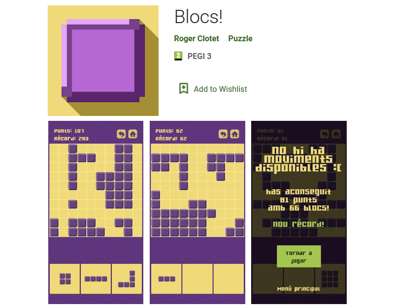

# Blocs!

A small puzzle game for mobile. The first game I published on the Google Play Store.

The gameplay is inspired by other puzzle games I tried before, but were full of ads and in-app purchases. I started learning game development some time before, took part in a game jam, and wanted to make a simple game to "test my skills", and this seemed like a good way of doing it.

You can install the game for free on Android in the [Play Store](https://play.google.com/store/apps/details?id=dev.clotet.Blocs) or play online on https://blocs.clotet.dev.

